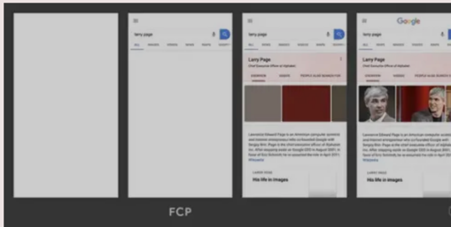

# 前端监控

一个完整的前端监控平台包括三个部分：数据采集与上报、数据整理和存储、数据展示。

## 一 性能数据采集

chrome 开发团队提出了一系列用于检测网页性能的指标：<br>

FP(first-paint)，从页面加载开始到第一个像素绘制到屏幕上的时间<br>
FCP(first-contentful-paint)，从页面加载开始到页面内容的任何部分在屏幕上完成渲染的时间<br>
LCP(largest-contentful-paint)，从页面加载开始到最大文本块或图像元素在屏幕上完成渲染的时间<br>
CLS(layout-shift)，从页面加载开始和其生命周期状态变为隐藏期间发生的所有意外布局偏移的累积分数<br>
这四个性能指标都需要通过 PerformanceObserver来获取（也可以通过 performance.getEntriesByName() 获取，但它不是在事件触发时通知的）。PerformanceObserver 是一个性能监测对象，用于监测性能度量事件。

### FP

FP(first-paint)，从页面加载开始到第一个像素绘制到屏幕上的时间。其实把 FP 理解成白屏时间也是没问题的。<br>
测量代码如下：
```js
const entryHandler = (list) => {
  for(const entry of list.getEntries()){
    if(entry.name === 'first-paint'){
      observer.disconnect()
    }
    console.log(entry)
  }
}
const observer = new PerformanceObserver(entryHandler);
observer.observe({type:'paint',buffered:true})
// buffered 属性表示是否观察缓存数据，也就是说，观察代码添加时机比事情触发时机晚也没关系
```
通过以上代码可以得到 FP 的内容:
```js
{
    duration: 0,
    entryType: "paint",
    name: "first-paint",
    startTime: 359, // fp 时间
}
```
其中 startTime 就是我们要的绘制时间。

### FCP

FCP(first-contentful-paint)，从页面加载开始到页面内容的任何部分在屏幕上完成渲染的时间。对于该指标，"内容"指的是文本、图像（包括背景图像）、< svg >元素或非白色的< canvas >元素。



为了提供良好的用户体验，FCP 的分数应该控制在 1.8 秒以内。

测量代码：
```js
const entryHandler = (list) => {        
    for (const entry of list.getEntries()) {
        if (entry.name === 'first-contentful-paint') {
            observer.disconnect()
        }
        
        console.log(entry)
    }
}

const observer = new PerformanceObserver(entryHandler)
observer.observe({ type: 'paint', buffered: true })
```
通过以上代码可以得到 FCP 的内容:
```js
{
    duration: 0,
    entryType: "paint",
    name: "first-contentful-paint",
    startTime: 459, // fcp 时间
}
```
其中 startTime 就是我们要的绘制时间。

### LCP

LCP(largest-contentful-paint)，从页面加载开始到最大文本块或图像元素在屏幕上完成渲染的时间。LCP 指标会根据页面首次开始加载的时间点来报告可视区域内可见的最大图像或文本块完成渲染的相对时间。<br>
一个良好的 LCP 分数应该控制在 2.5 秒以内。<br>
测量代码：
```js
const entryHandler = (list) => {
    if (observer) {
        observer.disconnect()
    }

    for (const entry of list.getEntries()) {
        console.log(entry)
    }
}

const observer = new PerformanceObserver(entryHandler)
observer.observe({ type: 'largest-contentful-paint', buffered: true })
```
通过以上代码可以得到 LCP 的内容:
```js
{
    duration: 0,
    element: p,
    entryType: "largest-contentful-paint",
    id: "",
    loadTime: 0,
    name: "",
    renderTime: 1021.299,
    size: 37932,
    startTime: 1021.299,
    url: "",
}
```
其中 startTime 就是我们要的绘制时间。element 是指 LCP 绘制的 DOM 元素。 <br>
FCP 和 LCP 的区别是：FCP 只要任意内容绘制完成就触发，LCP 是最大内容渲染完成时触发。

LCP 考察的元素类型为：

< img >元素<br>
内嵌在< svg >元素内的< image >元素<br>
< video >元素（使用封面图像）<br>
通过[url()](https://link.juejin.cn?target=https%3A%2F%2Fdeveloper.mozilla.org%2Fdocs%2FWeb%2FCSS%2Furl( "url()"))函数（而非使用CSS 渐变）加载的带有背景图像的元素
包含文本节点或其他行内级文本元素子元素的块级元素。

### CLS
CLS(layout-shift)，从页面加载开始和其生命周期状态变为隐藏期间发生的所有意外布局偏移的累积分数。

布局偏移分数的计算方式如下：<br>
布局偏移分数 = 影响分数 * 距离分数<br>

影响分数测量不稳定元素对两帧之间的可视区域产生的影响。<br>
距离分数指的是任何不稳定元素在一帧中位移的最大距离（水平或垂直）除以可视区域的最大尺寸维度（宽度或高度，以较大者为准）。<br>
CLS 就是把所有布局偏移分数加起来的总和。
当一个 DOM 在两个渲染帧之间产生了位移，就会触发 CLS<br>

一般用不到，暂不做赘述。

### DOMContentLoaded、load 事件

当纯 HTML 被完全加载以及解析时，DOMContentLoaded 事件会被触发，不用等待 css、img、iframe 加载完。

当整个页面及所有依赖资源如样式表和图片都已完成加载时，将触发 load 事件。

虽然这两个性能指标比较旧了，但是它们仍然能反映页面的一些情况。对于它们进行监听仍然是必要的。

```js
import { lazyReportCache } from '../utils/report'

['load', 'DOMContentLoaded'].forEach(type => onEvent(type))

function onEvent(type) {   
    function callback() {     
        lazyReportCache({        
            type: 'performance',       
            subType: type.toLocaleLowerCase(),    
            startTime: performance.now(),     
        })   
        
        window.removeEventListener(type, callback, true)    
    }  
    
    window.addEventListener(type, callback, true)
```
### 首屏渲染时间

大多数情况下，首屏渲染时间可以通过 load 事件获取。除了一些特殊情况，例如异步加载的图片和 DOM。

```js
<script>  
  setTimeout(() => {     
      document.body.innerHTML = `    
          <div>             
              <!-- 省略一堆代码... -->         
          </div>      
     `  
  }, 3000)
</script>
```
像这种情况就无法通过 load 事件获取首屏渲染时间了。这时我们需要通过 MutationObserver 来获取首屏渲染时间。MutationObserver 在监听的 DOM 元素属性发生变化时会触发事件。

首屏渲染时间计算过程：

* 利用 MutationObserver 监听 document 对象，每当 DOM 元素属性发生变更时，触发事件。
* 判断该 DOM 元素是否在首屏内，如果在，则在 requestAnimationFrame() 回调函数中调用 performance.now() 获取当前时间，作为它的绘制时间。
* 将最后一个 DOM 元素的绘制时间和首屏中所有加载的图片时间作对比，将最大值作为首屏渲染时间。

#### 监听 DOM
```js
const next = window.requestAnimationFrame ? requestAnimationFrame : setTimeout
const ignoreDOMList = ['STYLE', 'SCRIPT', 'LINK']   

observer = new MutationObserver(mutationList => { 
    const entry = {    
        children: [],  
    }  
    
    for (const mutation of mutationList) {   
        if (mutation.addedNodes.length && isInScreen(mutation.target)) {          
              // ...     
        }   
    }  
    
    if (entry.children.length) {     
        entries.push(entry)    
        next(() => {         
            entry.startTime = performance.now()    
        }) 
    }
})

observer.observe(document, {  
    childList: true,  
    subtree: true,
})
```
上面的代码就是监听 DOM 变化的代码，同时需要过滤掉 style、script、link 等标签。

#### 判断是否在首屏

一个页面的内容可能非常多，但用户最多只能看见一屏幕的内容。所以在统计首屏渲染时间的时候，需要限定范围，把渲染内容限定在当前屏幕内。

```js
const viewportWidth = window.innerWidth
const viewportHeight = window.innerHeight

// dom 对象是否在屏幕内
function isInScreen(dom) {  
    const rectInfo = dom.getBoundingClientRect()   
    if (rectInfo.left < viewportWidth && rectInfo.top < viewportHeight) {      
        return true  
    }  
    
    return false
}
```
使用 requestAnimationFrame() 获取 DOM 绘制时间。<br>
当 DOM 变更触发 MutationObserver 事件时，只是代表 DOM 内容可以被读取到，并不代表该 DOM 被绘制到了屏幕上。<br>
当触发 MutationObserver 事件时，可以读取到 document.body 上已经有内容了，但实际屏幕并没有绘制任何内容。所以要调用 requestAnimationFrame() 在浏览器绘制成功后再获取当前时间作为 DOM 绘制时间。

#### 和首屏内的所有图片加载时间作对比
```js
function getRenderTime() {   
    let startTime = 0  
    entries.forEach(entry => {    
        if (entry.startTime > startTime) {    
            startTime = entry.startTime   
        } 
    })  
    
    // 需要和当前页面所有加载图片的时间做对比，取最大值   
    // 图片请求时间要小于 startTime，响应结束时间要大于 startTime 
    performance.getEntriesByType('resource').forEach(item => {       
        if (        
            item.initiatorType === 'img'      
            && item.fetchStart < startTime       
            && item.responseEnd > startTime    
        ) {         
            startTime = item.responseEnd   
        }  
    })     
    
    return startTime
}
```
#### 优化

现在的代码还没优化完，主要有两点注意事项：
* 什么时候上报渲染时间？
* 如果兼容异步添加 DOM 的情况？
  
第一点，必须要在 DOM 不再变化后再上报渲染时间，一般 load 事件触发后，DOM 就不再变化了。所以我们可以在这个时间点进行上报。<br>
第二点，可以在 LCP 事件触发后再进行上报。不管是同步还是异步加载的 DOM，它都需要进行绘制，所以可以监听 LCP 事件，在该事件触发后才允许进行上报。

将以上两点方案结合在一起，就有了以下代码：
```js
let isOnLoaded = false
executeAfterLoad(() => {  
    isOnLoaded = true
})

let timer
let observer
function checkDOMChange() {  
    clearTimeout(timer) 
    timer = setTimeout(() => {     
        // 等 load、lcp 事件触发后并且 DOM 树不再变化时，计算首屏渲染时间       
        if (isOnLoaded && isLCPDone()) {      
            observer && observer.disconnect()      
            lazyReportCache({          
                type: 'performance',      
                subType: 'first-screen-paint',   
                startTime: getRenderTime(),      
                pageURL: getPageURL(),      
            })      
            
            entries = null      
        } else {       
            checkDOMChange()    
        }  
    }, 500)
}
```
checkDOMChange() 代码每次在触发 MutationObserver 事件时进行调用，需要用防抖函数进行处理。

### 接口请求耗时

接口请求耗时需要对 XMLHttpRequest 和 fetch 进行监听。<br>

监听 XMLHttpRequest

```js
originalProto.open = function newOpen(...args) {  
    this.url = args[1]  
    this.method = args[0]   
    originalOpen.apply(this, args)
}

originalProto.send = function newSend(...args) {   
    this.startTime = Date.now()  
    
    const onLoadend = () => {    
        this.endTime = Date.now()   
        this.duration = this.endTime - this.startTime   
        
        const { status, duration, startTime, endTime, url, method } = this       
        const reportData = {     
            status,         
            duration,        
            startTime,        
            endTime,          
            url,       
            method: (method || 'GET').toUpperCase(),    
            success: status >= 200 && status < 300,     
            subType: 'xhr',   
            type: 'performance',     
        }    
        
        lazyReportCache(reportData)    
        
        this.removeEventListener('loadend', onLoadend, true) 
   }  
  
   this.addEventListener('loadend', onLoadend, true)  
   originalSend.apply(this, args)
}
```

监听 fetch

```js
const originalFetch = window.fetch

function overwriteFetch() {  
    window.fetch = function newFetch(url, config) {    
        const startTime = Date.now()     
        const reportData = {     
            startTime,      
            url,      
            method: (config?.method || 'GET').toUpperCase(), 
            subType: 'fetch',      
            type: 'performance',    
        }      
        
        return originalFetch(url, config)     
        .then(res => {         
            reportData.endTime = Date.now()    
            reportData.duration = reportData.endTime - reportData.startTime         
            
            const data = res.clone()      
            reportData.status = data.status       
            reportData.success = data.ok       
            
            lazyReportCache(reportData)      
            
            return res     
        })    
        .catch(err => {    
            reportData.endTime = Date.now()    
            reportData.duration = reportData.endTime - reportData.startTime        
            reportData.status = 0      
            reportData.success = false    
            
            lazyReportCache(reportData)    
            
            throw err   
        })   
    }
}
```

注意，监听到的接口请求时间和 chrome devtool 上检测到的时间可能不一样。这是因为 chrome devtool 上检测到的是 HTTP 请求发送和接口整个过程的时间。但是 xhr 和 fetch 是异步请求，接口请求成功后需要调用回调函数。事件触发时会把回调函数放到消息队列，然后浏览器再处理，这中间也有一个等待过程。

### 资源加载时间、缓存命中率

通过 PerformanceObserver 可以监听 resource 和 navigation 事件，如果浏览器不支持 PerformanceObserver，还可以通过 performance.getEntriesByType(entryType) 来进行降级处理。

从这些字段中我们可以提取到一些有用的信息：

```js
{   
    name: entry.name, // 资源名称   
    subType: entryType,  
    type: 'performance', 
    sourceType: entry.initiatorType, // 资源类型  
    duration: entry.duration, // 资源加载耗时 
    dns: entry.domainLookupEnd - entry.domainLookupStart, // DNS 耗时  
    tcp: entry.connectEnd - entry.connectStart, // 建立 tcp 连接耗时   
    redirect: entry.redirectEnd - entry.redirectStart, // 重定向耗时 
    ttfb: entry.responseStart, // 首字节时间  
    protocol: entry.nextHopProtocol, // 请求协议  
    responseBodySize: entry.encodedBodySize, // 响应内容大小 
    responseHeaderSize: entry.transferSize - entry.encodedBodySize, // 响应头部大小   
    resourceSize: entry.decodedBodySize, // 资源解压后的大小 
    isCache: isCache(entry), // 是否命中缓存  
    startTime: performance.now(),
}
```

判断该资源是否命中缓存<br>
在这些资源对象中有一个  transferSize 字段，它表示获取资源的大小，包括响应头字段和响应数据的大小。如果这个值为 0，说明是从缓存中直接读取的（强制缓存）。如果这个值不为 0，但是 encodedBodySize 字段为 0，说明它走的是协商缓存（encodedBodySize 表示请求响应数据 body 的大小）。

```js
function isCache(entry) { 
    // 直接从缓存读取或 304 
    return entry.transferSize === 0 || (entry.transferSize !== 0 && entry.encodedBodySize === 0)
}
```
不符合以上条件的，说明未命中缓存。然后将所有命中缓存的数据/总数据就能得出缓存命中率。

### 浏览器往返缓存 BFC

bfcache 是一种内存缓存，它会将整个页面保存在内存中。当用户返回时可以马上看到整个页面，而不用再次刷新。据该文章 bfcache 介绍，firfox 和 safari 一直支持 bfc，chrome 只有在高版本的移动端浏览器支持。但原文作者试了一下，只有 safari 浏览器支持，可能原文作者的 firfox 版本不对。

但是 bfc 也是有缺点的，当用户返回并从 bfc 中恢复页面时，原来页面的代码不会再次执行。为此，浏览器提供了一个 pageshow 事件，可以把需要再次执行的代码放在里面。

```js
window.addEventListener('pageshow', function(event) { 
  // 如果该属性为 true，表示是从 bfc 中恢复的页面 
  if (event.persisted) {  
    console.log('This page was restored from the bfcache.'); 
  } else {   
    console.log('This page was loaded normally.'); 
  }
});
```

从 bfc 中恢复的页面，我们也需要收集他们的 FP、FCP、LCP 等各种时间。

```js
onBFCacheRestore(event => {  
    requestAnimationFrame(() => {     
        ['first-paint', 'first-contentful-paint'].forEach(type => {         
            lazyReportCache({          
                startTime: performance.now() - event.timeStamp,             
                name: type,         
                subType: type,         
                type: 'performance',         
                pageURL: getPageURL(),       
                bfc: true,      
            })  
        })  
    })
})
```
上面的代码很好理解，在 pageshow 事件触发后，用当前时间减去事件触发时间，这个时间差值就是性能指标的绘制时间。注意，从 bfc 中恢复的页面的这些性能指标，值一般都很小，一般在 10 ms 左右。所以要给它们加个标识字段 bfc: true。这样在做性能统计时可以对它们进行忽略。

### FPS

利用 requestAnimationFrame() 我们可以计算当前页面的 FPS。

```js
const next = window.requestAnimationFrame  
    ? requestAnimationFrame : (callback) => { setTimeout(callback, 1000 / 60) }
    
const frames = []

export default function fps() { 
    let frame = 0   
    let lastSecond = Date.now() 
    
    function calculateFPS() {    
        frame++    
        const now = Date.now()     
        if (lastSecond + 1000 <= now) {       
            // 由于 now - lastSecond 的单位是毫秒，所以 frame 要 * 1000         
            const fps = Math.round((frame * 1000) / (now - lastSecond))          
            frames.push(fps)            
            
            frame = 0       
            lastSecond = now    
        }      
        
        // 避免上报太快，缓存一定数量再上报    
        if (frames.length >= 60) {      
            report(deepCopy({           
                frames,         
                type: 'performace',     
                subType: 'fps',   
            }))          
            
            frames.length = 0   
        }    
        
        next(calculateFPS) 
    }   
    
    calculateFPS()
}
```

代码逻辑如下：

* 先记录一个初始时间，然后每次触发 requestAnimationFrame() 时，就将帧数加 1。过去一秒后用帧数/流逝的时间就能得到当前帧率。

当连续三个低于 20 的 FPS 出现时，我们可以断定页面出现了卡顿。

### Vue 路由变更渲染时间

首屏渲染时间我们已经知道如何计算了，但是如何计算 SPA 应用的页面路由切换导致的页面渲染时间呢？本文用 Vue 作为示例，讲一下思路。

```js
export default function onVueRouter(Vue, router) {  
    let isFirst = true   
    let startTime  
    router.beforeEach((to, from, next) => {    
        // 首次进入页面已经有其他统计的渲染时间可用   
        if (isFirst) {       
            isFirst = false      
            return next()      
        }    
        
        // 给 router 新增一个字段，表示是否要计算渲染时间    
        // 只有路由跳转才需要计算    
        router.needCalculateRenderTime = true    
        startTime = performance.now()     
        
        next() 
    })  
    
    let timer   
    Vue.mixin({   
        mounted() {     
            if (!router.needCalculateRenderTime) return   
            
            this.$nextTick(() => {        
                // 仅在整个视图都被渲染之后才会运行的代码    
                const now = performance.now()     
                clearTimeout(timer)            
                
                timer = setTimeout(() => {      
                    router.needCalculateRenderTime = false   
                    lazyReportCache({      
                        type: 'performance',   
                        subType: 'vue-router-change-paint', 
                        duration: now - startTime,     
                        startTime: now,  
                        pageURL: getPageURL(),  
                    })       
                }, 1000)     
            })    
        },   
    })
}
```
代码逻辑如下：

* 监听路由钩子，在路由切换时会触发 router.beforeEach() 钩子，在该钩子的回调函数里将当前时间记为渲染开始时间。
* 利用 Vue.mixin() 对所有组件的 mounted() 注入一个函数。每个函数都执行一个防抖函数。

当最后一个组件的 mounted() 触发时，就代表该路由下的所有组件已经挂载完毕。可以在 this.$nextTick() 回调函数中获取渲染时间。<br>
同时，还要考虑到一个情况。不切换路由时，也会有变更组件的情况，这时不应该在这些组件的 mounted() 里进行渲染时间计算。所以需要添加一个 needCalculateRenderTime 字段，当切换路由时将它设为 true，代表可以计算渲染时间了。

## 二 错误数据采集 

### 资源加载错误
使用 addEventListener() 监听 error 事件，可以捕获到资源加载失败错误。

```js
// 捕获资源加载失败错误 js css img...
window.addEventListener('error', e => { 
    const target = e.target  
    if (!target) return 
    
    if (target.src || target.href) {     
        const url = target.src || target.href     
        lazyReportCache({       
            url,       
            type: 'error',      
            subType: 'resource',       
            startTime: e.timeStamp,      
            html: target.outerHTML,      
            resourceType: target.tagName,    
            paths: e.path.map(item => item.tagName).filter(Boolean),       
            pageURL: getPageURL(),   
        })  
    }},
true)
```
### js 错误

使用 window.onerror 可以监听 js 错误。
```js
// 监听 js 错误
window.onerror = (msg, url, line, column, error) => {  
    lazyReportCache({      
        msg,     
        line,    
        column,    
        error: error.stack,     
        subType: 'js',     
        pageURL: url,    
        type: 'error',     
        startTime: performance.now(),  
    })
}
```
### promise 错误
使用 addEventListener() 监听 unhandledrejection 事件，可以捕获到未处理的 promise 错误。

```js
// 监听 promise 错误 缺点是获取不到列数据
window.addEventListener('unhandledrejection', e => {  
    lazyReportCache({    
        reason: e.reason?.stack,     
        subType: 'promise',     
        type: 'error',    
        startTime: e.timeStamp,     
        pageURL: getPageURL(),  
    })
})

```

### Vue 错误

利用 window.onerror 是捕获不到 Vue 错误的，它需要使用 Vue 提供的 API 进行监听。

```js
Vue.config.errorHandler = (err, vm, info) => {  
    // 将报错信息打印到控制台 
    console.error(err)  
    
    lazyReportCache({     
        info,    
        error: err.stack,     
        subType: 'vue',      
        type: 'error',     
        startTime: performance.now(),    
        pageURL: getPageURL(),  
    })
}
```

## 三 行为数据采集

### PV、UV

PV(page view) 是页面浏览量，UV(Unique visitor)用户访问量。PV 只要访问一次页面就算一次，UV 同一天内多次访问只算一次。

对于前端来说，只要每次进入页面上报一次 PV 就行，UV 的统计放在服务端来做，主要是分析上报的数据来统计得出 UV。
```js
export default function pv() {   
    lazyReportCache({    
        type: 'behavior',    
        subType: 'pv',     
        startTime: performance.now(),    
        pageURL: getPageURL(),  
        referrer: document.referrer,    
        uuid: getUUID(), 
    })
}
```
### 页面停留时长

用户进入页面记录一个初始时间，用户离开页面时用当前时间减去初始时间，就是用户停留时长。这个计算逻辑可以放在 beforeunload 事件里做。

```js
export default function pageAccessDuration() {  
    onBeforeunload(() => {     
        report({       
            type: 'behavior',       
            subType: 'page-access-duration',   
            startTime: performance.now(),      
            pageURL: getPageURL(),        
            uuid: getUUID(),   
        }, true)   
    })
}
```

### 页面访问深度

记录页面访问深度是很有用的，例如不同的活动页面 a 和 b。a 平均访问深度只有 50%，b 平均访问深度有 80%，说明 b 更受用户喜欢，根据这一点可以有针对性的修改 a 活动页面。

除此之外还可以利用访问深度以及停留时长来鉴别电商刷单。例如有人进来页面后一下就把页面拉到底部然后等待一段时间后购买，有人是慢慢的往下滚动页面，最后再购买。虽然他们在页面的停留时间一样，但明显第一个人更像是刷单的。

页面访问深度计算过程稍微复杂一点：

* 用户进入页面时，记录当前时间、scrollTop 值、页面可视高度、页面总高度。
* 用户滚动页面的那一刻，会触发 scroll 事件，在回调函数中用第一点得到的数据算出页面访问深度和停留时长。
* 当用户滚动页面到某一点时，停下继续观看页面。这时记录当前时间、scrollTop 值、页面可视高度、页面总高度。
* 重复第二点...

具体代码请看：
```js
let timer
let startTime = 0
let hasReport = false
let pageHeight = 0
let scrollTop = 0
let viewportHeight = 0

export default function pageAccessHeight() { 
    window.addEventListener('scroll', onScroll)  
    
    onBeforeunload(() => {    
        const now = performance.now()   
        report({       
            startTime: now,        
            duration: now - startTime,      
            type: 'behavior',       
            subType: 'page-access-height',      
            pageURL: getPageURL(),     
            value: toPercent((scrollTop + viewportHeight) / pageHeight),         
            uuid: getUUID(),     
        }, true)   
    })  
    
    // 页面加载完成后初始化记录当前访问高度、时间  
    executeAfterLoad(() => {    
        startTime = performance.now()    
        pageHeight = document.documentElement.scrollHeight || document.body.scrollHeight     
        scrollTop = document.documentElement.scrollTop || document.body.scrollTop     
        viewportHeight = window.innerHeight  
    })
}

function onScroll() {  
    clearTimeout(timer)  
    const now = performance.now()     
    
    if (!hasReport) {     
        hasReport = true   
        lazyReportCache({       
            startTime: now,      
            duration: now - startTime,  
            type: 'behavior',        
            subType: 'page-access-height',    
            pageURL: getPageURL(),        
            value: toPercent((scrollTop + viewportHeight) / pageHeight),          
            uuid: getUUID(),    
        })  
    }  
    
    timer = setTimeout(() => {     
        hasReport = false     
        startTime = now     
        pageHeight = document.documentElement.scrollHeight || document.body.scrollHeight     
        scrollTop = document.documentElement.scrollTop || document.body.scrollTop     
        viewportHeight = window.innerHeight      
    }, 500)
}

function toPercent(val) {  
    if (val >= 1) return '100%'   
    return (val * 100).toFixed(2) + '%'
}
```

### 用户点击

利用 addEventListener() 监听 mousedown、touchstart 事件，我们可以收集用户每一次点击区域的大小，点击坐标在整个页面中的具体位置，点击元素的内容等信息。

```js
export default function onClick() {  
    ['mousedown', 'touchstart'].forEach(eventType => {        
        let timer     
        window.addEventListener(eventType, event => {    
            clearTimeout(timer)       
            timer = setTimeout(() => {      
                const target = event.target     
                const { top, left } = target.getBoundingClientRect()                             
                
                lazyReportCache({         
                    top,               
                    left,               
                    eventType,            
                    pageHeight: document.documentElement.scrollHeight || document.body.scrollHeight,     
                    scrollTop: document.documentElement.scrollTop || document.body.scrollTop,      
                    type: 'behavior',     
                    subType: 'click',    
                    target: target.tagName,     
                    paths: event.path?.map(item => item.tagName).filter(Boolean),       
                    startTime: event.timeStamp,   
                    pageURL: getPageURL(),   
                    outerHTML: target.outerHTML,   
                    innerHTML: target.innerHTML,  
                    width: target.offsetWidth,    
                    height: target.offsetHeight,    
                    viewport: {   
                        width: window.innerWidth,  
                        height: window.innerHeight,   
                    },              
                    uuid: getUUID(),   
                })   
            }, 500)     
        }) 
    })
}
```

### 页面跳转

利用 addEventListener() 监听 popstate、hashchange 页面跳转事件。需要注意的是调用history.pushState()或history.replaceState()不会触发popstate事件。只有在做出浏览器动作时，才会触发该事件，如用户点击浏览器的回退按钮（或者在Javascript代码中调用history.back()或者history.forward()方法）。同理，hashchange 也一样。

```js
export default function pageChange() {
    let from = ''
    window.addEventListener('popstate', () => {
        const to = getPageURL()

        lazyReportCache({
            from,
            to,
            type: 'behavior',
            subType: 'popstate',
            startTime: performance.now(),
            uuid: getUUID(),
        })

        from = to
    }, true)

    let oldURL = ''
    window.addEventListener('hashchange', event => {
        const newURL = event.newURL

        lazyReportCache({
            from: oldURL,
            to: newURL,
            type: 'behavior',
            subType: 'hashchange',
            startTime: performance.now(),
            uuid: getUUID(),
        })

        oldURL = newURL
    }, true)
}
```

### Vue 路由变更

Vue 可以利用 router.beforeEach 钩子进行路由变更的监听。

```js
export default function onVueRouter(router) {
    router.beforeEach((to, from, next) => {
        // 首次加载页面不用统计
        if (!from.name) {
            return next()
        }

        const data = {
            params: to.params,
            query: to.query,
        }

        lazyReportCache({
            data,
            name: to.name || to.path,
            type: 'behavior',
            subType: ['vue-router-change', 'pv'],
            startTime: performance.now(),
            from: from.fullPath,
            to: to.fullPath,
            uuid: getUUID(),
        })

        next()
    })
}
```
## 四 数据上报

数据上报可以使用以下几种方式：

* sendBeacon
* XMLHttpRequest
* image
可以采用的是第一、第二种方式相结合的方式进行上报。利用 sendBeacon 来进行上报的优势非常明显。

::: tip 
使用 sendBeacon() 方法会使用户代理在有机会时异步地向服务器发送数据，同时不会延迟页面的卸载或影响下一导航的载入性能。这就解决了提交分析数据时的所有的问题：数据可靠，传输异步并且不会影响下一页面的加载。
:::

在不支持 sendBeacon 的浏览器下我们可以使用 XMLHttpRequest 来进行上报。一个 HTTP 请求包含发送和接收两个步骤。其实对于上报来说，我们只要确保能发出去就可以了。也就是发送成功了就行，接不接收响应无所谓。

为此，做了个实验，在 beforeunload 用 XMLHttpRequest 传送了 30kb 的数据（一般的待上报数据很少会有这么大），换了不同的浏览器，都可以成功发出去。当然，这和硬件性能、网络状态也是有关联的。

### 上报时机
上报时机有三种：

* 采用 requestIdleCallback/setTimeout 延时上报。
* 在 beforeunload 回调函数里上报。
* 缓存上报数据，达到一定数量后再上报。

建议将三种方式结合一起上报：

先缓存上报数据，缓存到一定数量后，利用 requestIdleCallback/setTimeout 延时上报。
在页面离开时统一将未上报的数据进行上报。

## 五 疑问清理

### 监听页面的XMLHttpRequest
```js
let open = window.XMLHttpRequest.prototype.open
let send = window.XMLHttpRequest.prototype.send
```

### Navigator.sendBeacon()
navigator.sendBeacon() 方法可用于通过HTTP将少量数据异步传输到Web服务器。

```js
navigator.sendBeacon(url, data);
// url 参数表明 data 将要被发送到的网络地址。
// data 参数是将要发送的 ArrayBufferView 或 Blob, DOMString 或者 FormData 类型的数据。
// 当用户代理成功把数据加入传输队列时，sendBeacon() 方法将会返回 true，否则返回 false。
```
这个方法主要用于满足统计和诊断代码的需要，这些代码通常尝试在卸载（unload）文档之前向web服务器发送数据。过早的发送数据可能导致错过收集数据的机会。然而，对于开发者来说保证在文档卸载期间发送数据一直是一个困难。因为用户代理通常会忽略在 unload (en-US) 事件处理器中产生的异步 XMLHttpRequest。

为了解决这个问题， 统计和诊断代码通常要在 unload 或者 beforeunload (en-US) 事件处理器中发起一个同步 XMLHttpRequest 来发送数据。同步的 XMLHttpRequest 迫使用户代理延迟卸载文档，并使得下一个导航出现的更晚。下一个页面对于这种较差的载入表现无能为力。

有一些技术被用来保证数据的发送。其中一种是通过在卸载事件处理器中创建一个图片元素并设置它的 src 属性的方法来延迟卸载以保证数据的发送。因为绝大多数用户代理会延迟卸载以保证图片的载入，所以数据可以在卸载事件中发送。另一种技术是通过创建一个几秒钟的 no-op 循环来延迟卸载并向服务器发送数据。

这些技术不仅编码模式不好，其中的一些甚至并不可靠而且会导致非常差的页面载入性能。

下面的例子展示了一个理论上的统计代码——在卸载事件处理器中尝试通过一个同步的 XMLHttpRequest 向服务器发送数据。这导致了页面卸载被延迟。
```js
window.addEventListener('unload', logData, false);

function logData() {
    var client = new XMLHttpRequest();
    client.open("POST", "/log", false); // 第三个参数表明是同步的 xhr
    client.setRequestHeader("Content-Type", "text/plain;charset=UTF-8");
    client.send(analyticsData);
}
```
这就是 sendBeacon() 方法存在的意义。使用 sendBeacon() 方法会使用户代理在有机会时异步地向服务器发送数据，同时不会延迟页面的卸载或影响下一导航的载入性能。这就解决了提交分析数据时的所有的问题：数据可靠，传输异步并且不会影响下一页面的加载。此外，代码实际上还要比其他技术简单许多！

下面的例子展示了一个理论上的统计代码模式——通过使用 sendBeacon() 方法向服务器发送数据。

```js
window.addEventListener('unload', logData, false);

function logData() {
    navigator.sendBeacon("/log", analyticsData);
}
```

### window.requestAnimationFrame

window.requestAnimationFrame() 告诉浏览器——你希望执行一个动画，并且要求浏览器在下次重绘之前调用指定的回调函数更新动画。该方法需要传入一个回调函数作为参数，该回调函数会在浏览器下一次重绘之前执行

当你准备更新动画时你应该调用此方法。这将使浏览器在下一次重绘之前调用你传入给该方法的动画函数(即你的回调函数)。回调函数执行次数通常是每秒60次，但在大多数遵循W3C建议的浏览器中，回调函数执行次数通常与浏览器屏幕刷新次数相匹配。为了提高性能和电池寿命，因此在大多数浏览器里，当requestAnimationFrame() 运行在后台标签页或者隐藏的< iframe > 里时，requestAnimationFrame() 会被暂停调用以提升性能和电池寿命。

回调函数执行次数通常与浏览器屏幕刷新次数相匹配。因此可用于测定FPS


