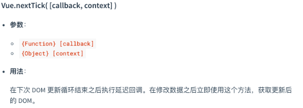
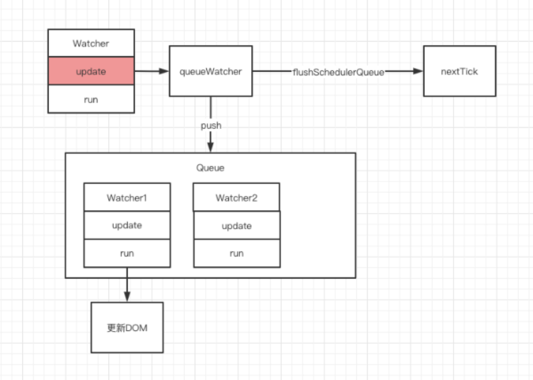

# 透过Vue的nextTick看浏览器的事件循环

### 文章摘要

本章节主要介绍前端框架 Vue 的 nextTick API 以及由此引申出来的浏览器的事件循环机制。文章主体内容一共分为两个部分。

第一部分主要是 Vue 的 nextTick API 的相关介绍以及源码分析等。

第二部分主要是浏览器的事件循环机制的介绍和作者自己的一些理解，这部分也是每位前端工程师的基本功，建议大家有时间的话可以精读一下，阅读过程中如果有问题欢迎交流指正。

### 1. 探秘 nextTick

#### 1.1 nextTick 的定义

关于 nextTick 的相关定义，我们可以很轻松的从 Vue 官网中找到，让我们来看一下官网是如何对 nextTick 定义的，如图 1 所示。



从官方文档中，我们可以看出，nextTick 本质上是一个方法，用来获取更新后的 DOM。那读到这里，可能有些小伙伴会有一些疑问。记得当初，作为一个 Vue 小白的我读到这里的时候，就曾经疑惑过以下几个问题： <br>
（1）在下次 DOM 更新循环结束之后，Vue 中 DOM 是否是同步更新还是异步更新。<br>
（2）获取更新后的 DOM，获取更新后的时机是在什么时候，此时更新后的 DOM 是否已经渲染。 带着这些疑惑，让我们接着往下探秘，相信很快就会水落石出。

#### 1.2 Vue 的异步更新队列

我们先来解答第一个疑惑：Vue 的 DOM 更新机制，是同步还是异步。 关于这个问题，我们可以很容易的从 Vue 官网得到对应的解答：事实上，Vue 采取的 DOM
更新机制确实不是同步的，它采取的更新机制是一种异步更新的机制。简单的说，如果 Vue 侦听到数据变化，就会开启一个队列，并缓冲在同一事件循环中发生的所有数据变更。具体的结果就是：如果同一个 watcher
被多次触发，只会被推入到队列中一次，如图 2 所示。



这种在缓冲时去除重复数据对于避免不必要的计算和 DOM 操作是非常重要的。然后，在下一个的事件循环“tick”中，Vue 刷新队列并执行实际 (已去重的) 工作。

#### 1.3 举个异步更新队列的例子

关于异步更新队列的机制，为了便于理解，我们可以举个例子，比如下面这段代码，当你设置 vm.someData = 'new value'，该组件并不会立即重新渲染。

```js
<div id="ex ample">{{message}}</div>

var vm = new Vue({el: '#example', data: {message: '123'}})
vm.message = 'new message' // 更改数据 vm.$el.textContent === 'new message' // false
```

运行这段代码，我们会发现，如果在设置完 vm.someData = 'new value' 之后，立即执行 vm.$el.textContent === 'new message' , 我们会得到 false，这说明此时的
vm.someData 还没有更新为 'new value'，证明 Vue 的 DOM 更新确实采用的是异步更新队列机制。

那如果我们想获取 vm .someData 的最新值，应该怎么做呢？这就需要用到上文中提到的 nextTick 了，接下来我们就会讲到 nextTick 的具体使用场景。

#### 1.4 引入 nextTick

在上面的例子中，当我们设置 vm.someData = 'new value'， 由于 Vue 的异步更新队列机制，someData 的值并不会立即更新，而是在下一个事件循环“tick”中更新。
关于这个过程呢，大多数情况下，我们是不需要关心的，但是如果你想基于更新之后的 DOM 状态来做点什么，这就可能会有些棘手。虽然 Vue 通常鼓励开发人员使用“数据驱动”的方式思考，避免直接接触DOM，但是有时我们必须要这么做。为了在数据变化之后等待 Vue 完成更新 DOM，可以在数据变化之后立即使用 Vue.nextTick(callback)。这样回调函数将在 DOM 更新完成后被调用。 比如上面那个例子，我们可以通过以下方式取到最新的值：

```js
var vm = new Vue({ el: '#example', data: { message: '123' } })
vm.message = 'new message' // 更改数据 vm.$el.textContent === 'new message' // false Vue.nextTick(function () {
vm.$el.textContent === 'new message' // true })
```

通过代码中的这种方式，我们就可以取到 message 的最新的值。 

#### 1.5 nextTick 的使用 
在上一小节中，大家已经大致清楚了 nextTick 的使用，本小节将会详细介如何在组件中使用 nextTick。 在组件内使用 vm.$nextTick() 实例方法其实特别方便，因为它不需要全局 Vue，并且回调函数中的 this 将自动绑定到当前的 Vue 实例上，相关代码如下：

```js
Vue.component('example', {
    template: '<span>{{ message }}</span>', 
    data: function () { 
      return { message: '未更新' } 
    },
   methods: { 
    updateMessage: function () { 
      this.message = '已更新' console.log(this.$el.textContent) // => '未更新' this.$nextTick(function () {
      console.log(this.$el.textContent) // => '已更新' })
    } } 
})
```

因为 $nextTick() 返回一个 Promise 对象，所以你可以使用新的 ES2017 async/await 语法完成相同的事情：
```js
methods: { 
  updateMessage: async function () {
    this.message = '已更新' console.log(this.$el.textContent) // => '未更新' await this.$nextTick()
    console.log(this.$el.textContent) // => '已更新' } }
```
 #### 1.6 nextTick 的执行时机 
在上面的几个小节中，我们已经了解了 Vue 的异步更新机制和 nextTick 的使用方法，解决了开篇关于 nextTick 定义的第一个疑惑，接下来，就该去解答第二个疑惑了。 获取更新后的 DOM，获取更新后的时机是在什么时候，此时更新后的 DOM 是否已经渲染。 由于这个问题的答案涉及到接下来将会讲述的
nextTick 的源码解析以及浏览器的事件循环机制，所以我们暂时先不公布答案，具体的解析会在讲完浏览器的事件循环机制后提供，请大家先接着往下看。

### 2. nextTick 源码解析 

本章节主要讲述 nextTick 源码，nextTick 是 Vue 的一个核心实现，基于浏览器的事件循环机制。nextTick 一共有两个版本的实现，本章节会对目前实现版本进行源码分析，而浏览器的事件循环机制会在后续章节中详细介绍。

#### 2.1 Vue nextTick 源码 

Vue nextTick 有多个版本的源码，我们先来看一下目前最新的 2.6 版本的源码，其中的代码并不多， 大概有几十行。接下来我们来看一下它的实现，先贴一下源码，大家可以先试着解读一下，下一小节会进行详细分析：

```js
import { noop } from 'shared/util'
import { handleError } from './error' 
import { isIE, isIOS, isNative } from './env' 
const callbacks = []
let pending = false 
function flushCallbacks () {
   pending = false
   const copies = callbacks.slice(0)
   callbacks.length = 0 
   for (let i = 0; i < copies.length; i++) {
     copies[i]()
   }
}
let timerFunc 
if (typeof Promise !== 'undefined' && isNative(Promise)) { 
   const p = Promise.resolve()
   timerFunc = () => { p.then(flushCallbacks)
   if (isIOS) setTimeout(noop)
   }
} else if (!isIE && typeof MutationObserver !== 'undefined' && (
   isNative(MutationObserver) || MutationObserver.toString() === '[object MutationObserverConstructor]'
   )) { 
   let counter = 1 
   const observer = new MutationObserver(flushCallbacks)
   const textNode = document.createTextNode(String(counter))
   observer.observe(textNode, { characterData: true })
   timerFunc = () => {
     counter = (counter + 1) % 2 textNode.data = String(counter)
   }
} else if (typeof setImmediate !== 'undefined' && isNative(setImmediate)) { 
   timerFunc = () => { setImmediate(
   flushCallbacks)
   }
} else { 
   timerFunc = () => { setTimeout(flushCallbacks, 0)
   } 
} 
export function nextTick (cb?: Function, ctx?: Object) { 
  let _resolve 
   callbacks.push(() => { 
     if (cb) {
       try {
        cb.call(ctx)
        } catch (e) {
       handleError(e, ctx, 'nextTick')
       }
    } else if (_resolve) {
   _resolve(ctx)
    } 
   })
   if (!pending) { 
     pending = true timerFunc()
   } 
   if (!cb && typeof Promise !== 'undefined') { 
     return new Promise(resolve => {
   _resolve = resolve })
   } 
}
```


#### 2.2 Vue nextTick 源码解析 

首先，在源码中定义了三个变量：

```js
const callbacks = []
let pending = false 
let timerFunc 
```

其中 callbacks 是用来存储所有需要执行的回调函数，pending 是用来标志是否正在执行回调函数，timerFunc 是用来触发执行回调函数。
接下来，让我们看一下 flushCallbacks 函数： 
```js
function flushCallbacks () { 
   pending = false
   const copies = callbacks.slice(0)
   callbacks.length = 0 
   for (let i = 0; i < copies.length; i++) { 
     copies[i]()
  } 
} 
```
这个函数用来执行 callbacks 里存储的所有回调函数。 <br>
接下来是将触发方式赋值给 timerFunc：
```js
if (typeof Promise !== 'undefined' && isNative(Promise)) {
    const p = Promise.resolve()
    timerFunc = () => { p.then(flushCallbacks)
    if (isIOS) setTimeout(noop)
  }
} else if (!isIE && typeof MutationObserver !== 'undefined' && (
isNative(MutationObserver) || MutationObserver.toString() === '[object MutationObserverConstructor]'
)) { 
    let counter = 1 
    const observer = new MutationObserver(flushCallbacks)
    const textNode = document.createTextNode(String(counter))
    observer.observe(textNode, { characterData: true })
    timerFunc = () => { 
      counter = (counter + 1) % 2 textNode.data = String(counter)
  } 
} else if (typeof setImmediate !== 'undefined' && isNative(setImmediate)) { 
  timerFunc = () => {
    setImmediate(flushCallbacks)
 } 
} else { 
  timerFunc = () => { 
    setTimeout(flushCallbacks, 0)
 } 
}
```
 先判断是否原生支持 promise，如果支持，则利用 promise 来触发执行回调函数； 否则，如果支持 MutationObserver，则实例化一个观察者对象，观察文本节点发生变化时，触发执行所有回调函数。<br>
如果以上两个都不支持，则会降级为 setImmediate 和 setTimeout。 最后是 nextTick 函数。因为 vm.nextTick 是一个即时函数，所以 源码里的 nextTick 函数是返回的函数，接受用户传入的参数，用来往 callbacks 里存入回调函数： 
```js
export function nextTick (cb?: Function, ctx?: Object) {
    let _resolve
    callbacks.push(() => { 
      if (cb) { 
        try { 
          cb.call(ctx)
        } catch (e) { 
          handleError(e, ctx, 'nextTick')
          } 
      } else if (_resolve) {
          _resolve(ctx)
      } 
    })
    if (!pending) { 
       pending = true
       timerFunc()
    } if (!cb && typeof Promise !== 'undefined') { 
      return new Promise(resolve => {
         _resolve = resolve })
   } 
} 
```
 关键在于 timeFunc()，该函数起到延迟执行的作用。 从上面的源码中，我们可以得知 timeFunc()一共有四种实现方式： <br>
 （1）Promise。 <br>
 （2）MutationObserve。 <br>
 （3）setImmediate。<br>
 （4）setTimeout。 <br>
 这四个都是异步任务，会在同步任务以及更新 DOM 的异步任务之后回调具体函数。 
 #### 2.3 分析总结 
目前最新的版本优先使用 microtask 作为异步延迟包装器，且写法相对简单。而早期版本 中，nextTick 的实现是 microTimerFunc、macroTimerFunc 组合实现的，延迟调用优先级是：Promise > setImmediate > MessageChannel > setTimeout。<br>
早期版本在重绘之前状态改变时会有小问题（如 [github.com/vuejs/vue/issues/6813](github.com/vuejs/vue/issues/6813)）。<br>
此外，在事件处理程序中使用 macrotask 会导致一些无法规避的奇怪行为（/issues/7109 等）。microtask 在某些情况下也是会有问题的，因为 microtask 优先级比较高，事件会在顺序事件（如 /issues/4521）之间甚至在同一事件的冒泡过程中触发（/issues/6566）。权衡了性能和场景之后，最终作者选择了上面这版源码作为最终版本。 

通过本章节对 nextTick 的分析，并结合上一节的 Vue 异步更新队列的介绍，我们了解到数据的变化到 DOM 的重新渲染是一个异步过程，发生在下一个 tick。关于源码中用到的 Promise、MutationObserver 等相关
API，因为涉及到了浏览器的事件循环，暂不在本章节讲解

#### 疑问解答 
在第一章节【探秘nextTick】的最后，我们还有以下一个疑问未解答，就是获取更新后的 DOM，获取更新后的 DOM 的这个时机，究竟是在什么时候，此时更新后的 DOM 是否已经渲染。

在熟悉了浏览器事件循环之后，让我们再回过头来看一下这个问题。前文中提到过，浏览器的 UI Render 是在 microTask 都执行完之后再进行。而通过对 nextTick 的分析，它实际是用 promise 包装的，属于
microTask。按理说目前还处在同一个事件循环，而且还没有进行 UI Render，我们来通过代码看一下，如何在 nextTick 能拿到刚渲染的 dom：

```js
<template>
  <div>
    {{title}}
  </div>
</template>
<script>
  export default {
  data() {
  return {
  title: ''
}
},
  mounted () {
  setTimeout(() => {
  this.title = '测试标题';
  this.$nextTick(() => {
  console.log(this.title);
  alert('渲染完成了吗')
})
}, 0)
}
}
</script>
```

因为 alert 能够阻塞渲染浏览器渲染，所以这里用到它。 在 alert 之前我们 console 了最新设置 dom 的内容，从控制台已经拿到了最新设置的 title。但是浏览器还没有进行渲染。再点击“确定”后，浏览器才进行渲染。

我之前一直以为获取新的 dom 节点必须等 UI Render 完成之后才能获取到，然而并不是这样的。 结论：在主线程及 microTask 执行过程中，每一次 dom 或 css 更新，浏览器都会进行计算，而计算的结果并不会被立刻渲染，而是在当所有的 microTask 队列中任务都执行完毕后，统一进行渲染（这也是浏览器为了提高渲染性能和体验做的优化）所以，这个时候通过 js 访问更新后的 dom 节点或者 css 是可以拿到的，因为浏览器已经完成计算，仅仅是它们还没被渲染而已。

### 总结
到这里的话，关于 nextTick 和浏览器的事件循环的相关知识就全部介绍完毕了，总结一下的话就是，nextTick 是基于浏览器的事件循环机制来获取更新后的 DOM，采取的策略是优雅降级：优先考虑用微任务 promise 和
   MutationObserver 实现，其次是用宏任务 setImmediate 和 setTimeout 来实现。 了解 nextTick 的实现，不仅可以让我们重温浏览器事件循环的相关知识，更可以帮我们更好把 nextTick
   应用到项目中去，定位相关的数据问题时也会更游刃有余，学以致用，才是我们不停学习的目的。至此，关于 nextTick 和浏览器事件循环全部结束，欢迎大家学习交流。


